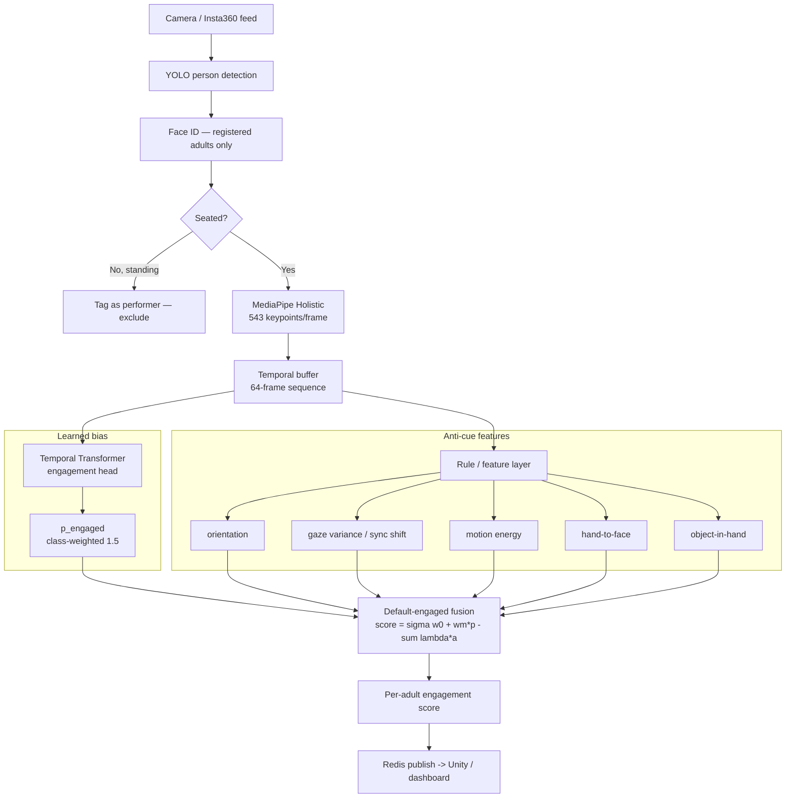
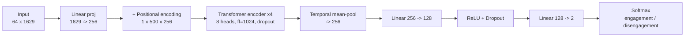
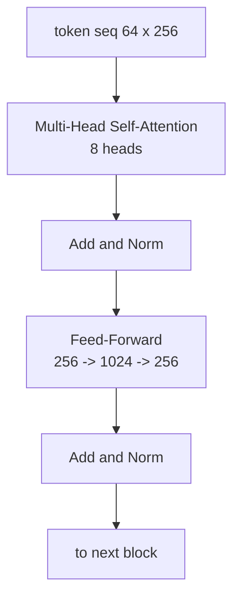

# Young Families Engagement Model — Design & Approach

**Branch:** `Retrain_Engagement_Model`  ·  **Model:** `action_transformer_young_families_v0`
**Status:** v0 training (2× Tesla T4, detached) on `sri-gpu-12t4`.
**Author context:** young-families ("Mothers & babies") concerts need a different
notion of engagement from the standard concert model.

---

## 1. Why a new model / profile

The standard concert model was trained on webcam-facing footage and **rewards
movement and direct gaze**. For young-families concerts that is wrong:

- Registered adults are **not** looking at the camera; if they are, they are
  usually *not* engaged in the performance.
- Parents' attention is often on **mobile performers** or on **their own child**.
- **High movement / arousal** here signals *low* engagement (agitation, chasing a
  toddler), the inverse of a standard gig.
- Parents are **seated** once the concert starts; a **standing adult** is most
  likely a **performer** and is excluded from audience scoring.

**Design decision:** keep the existing model as a **"Standard/Concert" profile**
and add a **"Young Families" profile**, selectable in the GUI. Every engagement
model shares the same input contract (543-keypoint MediaPipe sequence → binary
head), so switching profiles is just loading a different `state_dict` (+ its
label semantics and post-processing rules).

---

## 2. Engagement as a *default* — bias & algorithm

The core stance: **presume high engagement and only subtract when an
anti-engagement cue is detected.** This is encoded in two complementary layers.

### 2a. Learned bias (in the model)
- **Class-weighted loss.** `CrossEntropyLoss(weight=[engagement=1.5, disengagement=1.0])`
  tilts the decision boundary toward *engaged*, so ambiguous poses default to
  engaged rather than disengaged.
- **Label semantics.** The fine→binary map is re-pointed for this audience — most
  notably `staring` (long, still fixation) flips from *disengaged* → **engaged**,
  because sustained attention on the stage is a positive signal for parents.

### 2b. Rule/feature layer (post-processing, outside the model)
Cues that are **not discrete actions** cannot be learned from the Kinetics action
set — they are geometric/temporal features computed from the pose stream and the
detector, then used to *subtract* from the default-engaged score:

$$\text{score} = \sigma\!\big(w_0 + w_m \cdot p_\text{engaged} - \textstyle\sum_k \lambda_k \, a_k\big)$$

where $p_\text{engaged}$ is the model probability, $a_k$ are anti-cue activations
(orientation, gaze shift, motion energy, hand-to-face, object-in-hand), $w_0$ is
the **default-engaged prior**, and $\lambda_k$ their penalties.

---

## 3. Action & feature taxonomy

Legend: **✅** covered by the trained action head · **⚠️** exists in Kinetics-700
but weak in pose-only / needs face · **❌** not an action — a pose/gaze/orientation/
arousal/object *feature* handled by the rule layer.

### Pro-engagement
| Cue | Coverage | Where handled |
|-----|----------|---------------|
| Clapping hands | ✅ | action head (`applause`) |
| Clicking / snapping fingers | ⚠️ | action head (weak); candidate feature |
| Tapping hands on lap | ❌ | rhythmic-motion feature |
| Singing along | ✅ / ⚠️ | action head + mouth/jaw landmarks (or audio) |
| Smiling | ⚠️ | **face** channel, not body pose |
| Mimicking performers (dancing) | ✅ | action head (`dancing`) |
| Still head / long gaze fixation | ❌ → **learned flip** | `staring`→engaged + head-pose-variance feature |
| Seated | ❌ | posture feature; standing→performer gate |

### Anti-engagement
| Cue | Coverage | Where handled |
|-----|----------|---------------|
| Moving around a lot / agitation | ❌ | motion-energy feature (inverted sign) |
| Touching face | ⚠️/❌ | hand-to-face-proximity feature |
| Talking | ⚠️ | face/audio (unreliable pose-only) |
| Drinking | ✅ | action head (`eating_drinking`) |
| Eating | ✅ | action head (`eating_drinking`) |
| Distracted by child (holding arm) | ❌ | body-orientation + arm-pose feature |
| Turned away from performance | ❌ | torso/head orientation feature |
| Sudden synchronous gaze shift (multi-parent) | ❌ | multi-person temporal feature |
| Holding objects (phone) | ✅ | action head (`phone_distraction`) |
| Holding objects (bottle/other) | ❌ | object-in-hand (YOLO detector) feature |

**Key takeaway:** ~half the cues (clapping, dancing, singing, eating, drinking,
phone) map to the trained action head; the other half are **features/rules**, not
Kinetics actions. Hence the **hybrid** design rather than forcing everything
through an action classifier.

---

## 4. New features (rule layer)

Computed per registered adult, per rolling window, from the 543-keypoint stream
(+ YOLO boxes). All are cheap and run in the live post-processor.

- **Head-pose variance** — low variance over time ⇒ sustained fixation ⇒ *engaged*.
- **Synchronous gaze shift** — sudden, *shared* head-orientation change across
  multiple parents ⇒ distraction event ⇒ *disengaged*.
- **Torso/head orientation** — yaw away from the stage axis ⇒ *disengaged*.
- **Motion energy / arousal** — windowed keypoint velocity; high ⇒ agitation ⇒
  *disengaged* (inverted vs standard model).
- **Hand-to-face proximity** — wrist landmark near face box ⇒ touching face.
- **Object-in-hand** — YOLO object overlapping the hand (bottle/phone).
- **Seated/standing geometry** — hip/knee vertical arrangement; standing adult ⇒
  treated as performer, excluded from scoring.

---

## 5. Pipeline

---

## 6. Model architecture

`TemporalTransformer` — identical input contract to the standard model, so
profiles are hot-swappable.

- **Input:** 64 frames × (543 keypoints × 3) = 64 × 1629
- **d_model:** 256 · **heads:** 8 · **encoder layers:** 4 · **dropout:** 0.1–0.3
- **Head:** mean-pool over time → 256 → 128 → **2** (engagement / disengagement)
- **Params:** ~3.4M (4-layer/256d variant)

Layer stack (per encoder block):

---

## 7. Training configuration (v0)

| Setting | Value |
|---------|-------|
| Server | `sri-gpu-12t4` (192.168.200.206) |
| GPUs | physical **0 and 8** (`CUDA_VISIBLE_DEVICES=0,8`), 2× T4 DDP |
| Features | `data/processed/features_kinetics700` (reused, no re-extraction) |
| Labels | `hierarchical_labels_young_families.json` (staring→engagement) |
| Loss | `CrossEntropyLoss(weight=[engagement=1.5, disengagement=1.0])` |
| Batch | 32/GPU × 2 = 64 · **Epochs** 50 · **LR** 1e-4 · **Seq** 64 |
| Output | `models/action_transformer_young_families_v0/best_model.pth` |
| Run mode | detached (`nohup`), polled ~every 5 min |

The standard model (`action_transformer_12gpus_binary_v2_cleaned`) is **untouched**;
this is a separate, additive model. Future context profiles (Theatre, Schools…)
follow the same pattern: a new `hierarchical_labels_<profile>.json` + launch
script + `--output-dir`, selected in the GUI.

---

## 8. Roadmap to v1 (needs data)

- Label real young-families footage (auto-annotate with this pipeline, then
  manual correction on extracted frames).
- Add the **face channel** (smiling, talking) and optional **audio** (singing).
- Implement and tune the rule-layer penalties $\lambda_k$ on held-out sessions.
- Validate against current-model baselines before release.
